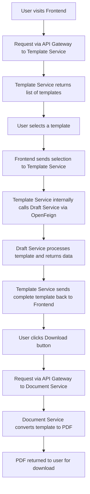

# ⚖️ Legal Draft Automation System (LDAS)

> A **Microservices-Based Cloud-Native Legal Platform** designed to automate the creation, management, and distribution of legal drafts and documents — built with modern backend engineering and real-world DevOps practices.

---

## 📌 Table of Contents

- [Overview](#-overview)
- [System Architecture](#-system-architecture)
- [Request Flow](#-request-flow)
- [Flowchart](#-flowchart)
- [Microservices](#-microservices)
- [Technologies Used](#-technologies-used)
- [Prerequisites](#-prerequisites)
- [Getting Started](#-getting-started)
- [Kubernetes Concepts Implemented](#-kubernetes-concepts-implemented)
- [Spring Boot Actuator Endpoints](#-spring-boot-actuator-endpoints)
- [Useful Kubernetes Commands](#-useful-kubernetes-commands)
- [Troubleshooting](#-troubleshooting)
- [Future Improvements](#-future-improvements)
- [Author](#-author)

---

## 📖 Overview

**Legal Draft Automation System (LDAS)** is a scalable, cloud-native platform that automates the end-to-end lifecycle of legal document creation — from browsing templates to generating downloadable PDFs.

The purpose of this project is to provide **scalable, maintainable, and distributed legal document services** using modern backend engineering and DevOps practices.

The system is built using a **Spring Boot Microservices** architecture where each service handles an independent business responsibility. All client requests are routed through a centralized **API Gateway**, and services communicate internally using **OpenFeign** clients.

This project also serves as a **practical cloud-native learning platform** implementing real-world technologies including:

- ✅ Spring Boot Microservices
- ✅ API Gateway with centralized routing
- ✅ Docker Containerization
- ✅ Kubernetes Orchestration
- ✅ KIND (Kubernetes IN Docker) Cluster
- ✅ Resource Limits & Requests
- ✅ Liveness, Readiness, and Startup Probes
- ✅ Kubernetes Services and Deployments
- ✅ Rolling Updates & Docker Image Versioning
- ✅ CI/CD Concepts
- ✅ Cloud-Native Scalability

The frontend is developed using **React + Vite** and served using **NGINX** for production-ready deployment, mimicking real-world production environments like **AWS EKS**.

---

## 🏛️ System Architecture

The platform follows a **microservices architecture** where each service is independently deployable, scalable, and responsible for a single business domain.

```
┌─────────────────────────────────────────────────────────────────┐
│                        USER (Browser)                           │
│                     React + Vite Frontend                        │
│                    (Served via NGINX)                            │
└─────────────────────────┬───────────────────────────────────────┘
                          │  HTTP Requests (Port 8080)
                          ▼
┌─────────────────────────────────────────────────────────────────┐
│                      API GATEWAY SERVICE                         │
│              (Spring Cloud Gateway — Port 8083)                 │
│         Centralized Routing, Load Balancing, Filtering          │
└──────────┬─────────────────────────┬───────────────────────────┘
           │                         │
           ▼                         ▼
┌──────────────────┐      ┌──────────────────────────────────────┐
│  TEMPLATE SERVICE│      │         DOCUMENT SERVICE              │
│  (Browse & Fill  │◄─────│  (PDF Generation from filled         │
│   Legal Templates│      │   template — iText / Thymeleaf)      │
│   — OpenFeign ──►│      └──────────────────────────────────────┘
│   calls Draft    │
│   Service)       │
└────────┬─────────┘
         │  Internal HTTP call via OpenFeign
         ▼
┌──────────────────┐
│  DRAFT SERVICE   │
│  (Processes &    │
│  Populates legal │
│  draft content   │
│  into template)  │
└──────────────────┘
```

---

## 🔄 Request Flow

The system processes user requests through **three distinct phases**:

### Phase 1 — Browse Templates
1. User opens the React frontend and requests available legal templates.
2. The request hits the **API Gateway**.
3. The API Gateway routes the request to the **Template Service**.
4. Template Service fetches available templates and returns them to the user.

### Phase 2 — Fill Draft
5. User selects a template — a new request is sent to the **API Gateway**.
6. API Gateway routes it to the **Template Service** again.
7. Template Service internally calls the **Draft Service** via **OpenFeign** (service-to-service communication).
8. Draft Service processes the legal content, populates the template, and returns it to Template Service.
9. Template Service returns the filled draft back to the user.

### Phase 3 — Download PDF
10. User clicks the **Download** button.
11. Request flows through the **API Gateway** to the **Document Service**.
12. Document Service converts the filled template into a **PDF document**.
13. The generated PDF is returned to the user for download.

---

## 📊 Flowchart



---

## 🧩 Microservices

| Service | Port | Responsibility |
|---|---|---|
| **API Gateway** | `8083` | Central entry point; routes all incoming client requests to the appropriate microservice |
| **Template Service** | Internal | Manages and serves legal document templates; orchestrates draft generation via OpenFeign |
| **Draft Service** | Internal | Processes legal content and populates the selected template with appropriate draft data |
| **Document Service** | Internal | Converts the finalized template/draft into a downloadable PDF document |
| **Frontend** | `8080` | React + Vite UI served via NGINX; user-facing interface for browsing, filling, and downloading documents |

### Service Communication

```
Client ──► API Gateway ──► Template Service ──► Draft Service
                                                (OpenFeign — internal)
Client ──► API Gateway ──► Document Service
```

- **External communication:** All client traffic goes through the API Gateway only.
- **Internal communication:** Template Service uses **Spring Cloud OpenFeign** to call Draft Service — no direct client access.

---

## 🛠️ Technologies Used

### Backend
| Technology | Purpose |
|---|---|
| Java 17 | Core programming language |
| Spring Boot | Microservice framework |
| Spring Cloud Gateway | API Gateway and routing |
| Spring Cloud OpenFeign | Declarative HTTP client for inter-service communication |
| Spring Boot Actuator | Health monitoring and observability |
| Maven | Build and dependency management |

### Frontend
| Technology | Purpose |
|---|---|
| React | UI component library |
| Vite | Fast frontend build tool |
| Axios | HTTP client for API calls |
| NGINX | Production web server for serving the React build |

### DevOps & Cloud
| Technology | Purpose |
|---|---|
| Docker | Service containerization |
| Docker Compose | Multi-container orchestration for local development |
| Kubernetes | Container orchestration for production-like deployment |
| KIND Cluster | Kubernetes IN Docker — local K8s cluster |
| kubectl | Kubernetes CLI |

---

## ✅ Prerequisites

Install the following tools before running the project:

| Tool | Purpose |
|---|---|
| [Git](https://git-scm.com/) | Version control |
| [JDK 17](https://adoptium.net/) | Java runtime for Spring Boot services |
| [Maven](https://maven.apache.org/) | Build tool for backend services |
| [Docker Desktop](https://www.docker.com/products/docker-desktop/) | Container runtime |
| [kubectl](https://kubernetes.io/docs/tasks/tools/) | Kubernetes CLI |
| [KIND](https://kind.sigs.k8s.io/) | Local Kubernetes cluster via Docker |

---

## 🚀 Getting Started

### 1. Clone the Repository

```bash
git clone https://github.com/Muhammad-Muzamil1/Legal-Drafting-Automation-System
cd "Microservices Based Automated Legal Drafting Platform"
```

### 2. Create KIND Cluster

```bash
kind create cluster --config kind-config.yaml --name cluster
kubectl get nodes
```

### 3. Build Backend Services

Build each Spring Boot service using Maven:

```bash
# API Gateway
cd ApiGateway
mvn clean package
cd ..

# Template Service
cd TemplateService
mvn clean package
cd ..

# Draft Service
cd DraftService
mvn clean package
cd ..

# Document Service
cd DocumentService
mvn clean package
cd ..
```

### 4. Build Docker Images

```bash
docker compose build
```

### 5. Push Docker Images

```bash
docker compose push
```

### 6. Deploy to Kubernetes

```bash
cd K8s
kubectl apply -f . -n ldas

# Verify deployments
kubectl get deployments -n ldas
kubectl get pods -n ldas
kubectl get svc -n ldas
```

### 7. Access the Application

**Frontend:**
```bash
kubectl port-forward service/frontend-service 8080:80 -n ldas
```
Open: [http://localhost:8080](http://localhost:8080)

**API Gateway:**
```bash
kubectl port-forward service/api-gateway-service 8083:8083 -n ldas
```
Gateway URL: [http://localhost:8083](http://localhost:8083)

---

## ☸️ Kubernetes Concepts Implemented

| Concept | Description |
|---|---|
| **Namespaces** | All resources deployed under `ldas` namespace for isolation |
| **Pods** | Individual running containers for each microservice |
| **Deployments** | Declarative updates and desired state management |
| **ReplicaSets** | Ensures the desired number of pod replicas are running |
| **Services** | Stable network access to pods (ClusterIP / NodePort) |
| **NodePort** | Exposes services outside the cluster for local access |
| **Resource Requests & Limits** | CPU and memory constraints per pod |
| **Liveness Probes** | Restarts unhealthy containers automatically |
| **Readiness Probes** | Ensures traffic is sent only to ready pods |
| **Startup Probes** | Gives slow-starting containers time to initialize |
| **Rolling Updates** | Zero-downtime deployments with version updates |
| **Docker Image Versioning** | Controlled image updates across deployments |

---

## 🩺 Spring Boot Actuator Endpoints

All backend services expose the following health endpoints:

| Endpoint | URL | Description |
|---|---|---|
| **General Health** | `/actuator/health` | Overall service health status |
| **Liveness** | `/actuator/health/liveness` | Used by Kubernetes Liveness Probe |
| **Readiness** | `/actuator/health/readiness` | Used by Kubernetes Readiness Probe |

---

## 🔧 Useful Kubernetes Commands

```bash
# View all pods in the namespace
kubectl get pods -n ldas

# View all services
kubectl get svc -n ldas

# View logs for a specific pod
kubectl logs <pod-name> -n ldas

# Describe a pod (useful for debugging)
kubectl describe pod <pod-name> -n ldas

# Restart a deployment (rolling restart)
kubectl rollout restart deployment <deployment-name> -n ldas

# Scale a deployment
kubectl scale deployment <deployment-name> --replicas=5 -n ldas

# Watch pod status in real time
kubectl get pods -n ldas -w
```

---

## 🐛 Troubleshooting

### Pods Stuck in `ContainerCreating`
```bash
kubectl describe pod <pod-name> -n ldas
```
Check the **Events** section at the bottom of the output for specific errors (image pull issues, resource limits, etc.).

### Maven Clean Failure on Windows
If the JVM process is locking files during build:
```bash
taskkill /F /IM java.exe
mvn clean package
```

### KIND Cluster Nodes Not Ready
```bash
kubectl get nodes
kubectl describe node <node-name>
```

### Services Not Accessible via Port-Forward
Ensure the pod is in `Running` state before port-forwarding:
```bash
kubectl get pods -n ldas
kubectl port-forward service/<service-name> <local-port>:<service-port> -n ldas
```

---

## 🔮 Future Improvements

| Improvement | Description |
|---|---|
| **Ingress Controller** | Replace NodePort with NGINX Ingress for cleaner routing |
| **HTTPS with TLS** | Secure communication using cert-manager and Let's Encrypt |
| **Helm Charts** | Package Kubernetes manifests for reusable, configurable deployments |
| **CI/CD with Jenkins** | Automate build, test, and deploy pipeline |
| **AWS EKS Deployment** | Deploy on managed Kubernetes in the cloud |
| **HPA Autoscaling** | Horizontal Pod Autoscaler for dynamic traffic handling |
| **Prometheus & Grafana** | Full observability stack — metrics, dashboards, alerting |
| **GitOps with ArgoCD** | Declarative, Git-driven continuous delivery |
| **Distributed Tracing** | Add Zipkin or Jaeger for request tracing across services |
| **API Rate Limiting** | Implement rate limiting at the Gateway level |

---

## 👨‍💻 Author

**Muhammad Muzamil**

*Software Engineer | Java Backend Developer | Kubernetes & DevOps Learner*

> This project demonstrates how modern scalable systems are built, containerized, deployed, monitored, and managed inside Kubernetes clusters — mirroring real-world production cloud environments like AWS EKS.

---

<div align="center">

⭐ If you found this project helpful, give it a star!

</div>
